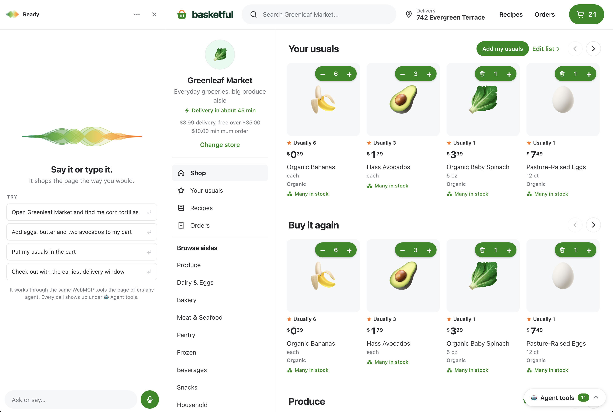

# Shopping Cart WebMCP Demo

**Basketful** is a grocery shopping demo that exposes search, cart management, and checkout through [WebMCP](https://github.com/webmachinelearning/webmcp) ([explainer](https://webmcp-demo-sdras.netlify.app/)). Users can interact through the website or through an agent calling the site's tools. The demo illustrates how both interfaces share application state and shopping logic. Orders are simulated; no payment or delivery occurs.



## Run it

```bash
npm install
npm run dev
```

To enable WebMCP, use Chrome 149+ with `chrome://flags/#enable-webmcp-testing` (add
`#devtools-webmcp-support` for the DevTools pane). The site also works without WebMCP.

To use the built-in assistant, open “Ask or Say” in the bottom-left corner and enter a Gemini API key.

The [Jev Chrome extension](https://github.com/sdras/jev-webmcp-extension) provides another way to interact with the site's WebMCP tools, predicting tool calls and arguments as you type.

The 🤖 **Agent tools** pill in the bottom corner lists what's registered on the current page and
logs each call with its input and output.

## The tools

| Tool | Where | What it does | Hint |
| --- | --- | --- | --- |
| `choose_store` | everywhere | Open a store; each has its own cart, prices, fees | |
| `search_products` | everywhere | Query, department, dietary, and price filters; mirrors results on the page | read-only |
| `add_to_cart` | everywhere | Add a whole list by product name in one call | |
| `update_cart_item` | everywhere | Set an exact quantity, or 0 to remove | |
| `get_cart` | everywhere | Items, fees, total, order minimum; opens the cart drawer | read-only |
| `get_staples` | everywhere | The saved staples list, with stock and cart state at the open store | read-only |
| `update_staples` | everywhere | Save, change, or remove staples and their out-of-stock rule; a whole list in one call | |
| `add_staples_to_cart` | everywhere | Top the cart up to the usual quantity of every staple, applying swap/skip rules | |
| `add_recipe_to_cart` | everywhere | A site recipe or any ingredient list → only what's missing, with its reasoning and the questions to ask | |
| `start_checkout` | everywhere | Go to checkout; returns windows and what's still missing | |
| `get_order_status` | everywhere | Stage, shopper, items, total; opens the tracking page | read-only |
| `set_delivery_address` | checkout | **Declarative**: a plain `<form toolname>` | |
| `set_delivery_options` | checkout | Delivery window, tip (`"$5"`, `"15%"`, `"none"`), replacements | |
| `place_order` | checkout | Places the order | consequential |

Tool behavior:

- **Product names.** Agents refer to products by the names `search_products` returns. An
  ambiguous name ("milk") comes back with the candidates so the agent can ask the shopper.
- **Error guidance.** "No store is open yet. Call choose_store first with
  one of: …", "Add $3.50 more before checking out."
- **Partial results.** `add_to_cart` says what went in and why the rest
  didn't (out of stock, not found, ambiguous).
- **Dynamic checkout tools.** `set_delivery_options` and `place_order` only exist while the
  checkout page is showing an orderable cart. The delivery window `enum` is rebuilt as the clock moves.
- **Visible tool actions.** Searches navigate, `get_cart` opens the drawer,
  adds raise a toast, and a tool only reports back after the page has painted.
- **Idempotent cart top-up.** `add_staples_to_cart` tops the cart up to each staple's usual
  quantity instead of adding it again, so repeated calls or clicks on "Add all" do not duplicate quantities. It reports what it added, what was already there, and
  what's out of stock with guidance to use `search_products` for a substitute.
- **Tool registration during execution.** `place_order` empties the cart, which also disables the tool. Unregistering mid-call loses the result (Chrome < 153), so `useTool` keeps a tool
  registered until its call has reported back, and the checkout tools mount at the app root.

## Saved staples and repeat purchases

The tools refer to saved repeat purchases as staples; the page labels them “Your usuals”.
Users can build this list from their order history:

1. **Order confirmation.** The confirmation page offers purchased items as selectable staples, using the quantities from the order and preselecting items ordered previously.
2. **Purchase history.** The `/usuals` page suggests frequently purchased items. Users can accept or dismiss suggestions, and dismissals are remembered.
3. **Cart top-up.** An empty cart offers to add saved staples, showing the item count and estimated cost. The resulting notification includes an Undo action.
4. **Out-of-stock preferences.** Users can choose a substitute for one order, save it for future orders, or skip the item when unavailable. Substitutes are restricted to similar products (`similarProducts`); the site reports when no suitable substitute is available.

Agents receive corresponding information from the tools: `place_order` reports repeat
purchases that are not yet staples, and `add_staples_to_cart` reports out-of-stock items without
saved preferences, suggested substitutes, and instructions for saving a preference through
`update_staples` → `if_out_of_stock`.

## Recipe planning and pantry estimates

For each ingredient, the planner (`src/lib/recipes.js`) uses cart contents, purchase history,
and estimated shelf life to propose an action and explain its assumptions:

| Verdict | When | What it says |
| --- | --- | --- |
| already in the cart | it is in the cart and has not been allocated to another recipe | "Already in your cart." |
| have it | a cupboard item (oregano, oil, salt) bought within its shelf life | "Bought 2 months ago, keeps about 2 years." |
| ask | bought recently enough that it might still be there | "Bought 5 days ago. Still have it?" |
| add | no purchase history, or the purchase is older than its estimated shelf life | "Last bought 2 weeks ago, keeps about 7 days: assuming it's gone." |

Users can correct estimates with “I have this” or “I’m out”. Corrections are retained until
the product is purchased again. Product data includes estimated shelf life and whether an item lasts for multiple uses.

Recipe quantities are reconciled across repeated additions and shared ingredients. Each recipe
records what it uses and what it added. Applying
a recipe takes its old additions out before putting the new plan in, so applying twice, or again
with different answers, never doubles anything. Bags and jars are shared between recipes (one
bunch of cilantro does tacos and guacamole); things sold one at a time are counted (two recipes
that each want 2 limes want 4). Taking a recipe out of the cart removes what it added, except a
shared bag another recipe still needs.

For agents it's one tool, `add_recipe_to_cart`: pass `recipe` (an enum of the site's recipes) or
`ingredients` exactly as any recipe writes them ("2 large tomatoes, diced"). It adds what's
certain, states its assumptions, and returns the questions. The agent relays them and calls again
with `already_have` / `need`; `preview: true` answers "what would I need?" without touching the
cart. Loose ingredient matches are reported ("tomatoes → Tomatoes on the Vine (or Diced
Tomatoes)") so the agent can correct them.

Recipe pages offer **sample order history** for testing pantry estimates
(spices two months ago, tomatoes two weeks ago, eggs last week), with an option to remove it.

## Using an agent skill with WebMCP

`skills/grocery-staples/` is an Agent Skill that stores a user's shopping preferences and applies them through the site's tools:

- **Shopping preferences.** `staples.md` holds what they buy, how many, and what to do
  when something's out ("Oat Milk ×2. Barista is fine. Never almond."). The file can be reused across stores.
- **Site interaction.** The skill calls
  `choose_store` → `update_staples` (sync the list, with each row's out-of-stock note as a rule)
  → `add_staples_to_cart` (swaps and skips happen here) → `get_cart`, and stops at the cart.

Install it, edit the list, then say "add my staples" (example):

```bash
cp -R skills/grocery-staples ~/.claude/skills/
$EDITOR ~/.claude/skills/grocery-staples/staples.md
```

Because the list is synced into the site, the person can also hit **Add all to cart** on the
"Your staples" shelf, and any other agent can call `add_staples_to_cart` without the skill.

## Built-in voice and chat assistant

“Ask or say…” in the bottom-left corner (or ⌘J) opens a voice and chat assistant powered by
[Gemini Live](https://ai.google.dev/gemini-api/docs/live). It uses the site's registered tools
for shopping actions. The assistant requires a Gemini API key, stored in a separate localStorage
entry in the browser and not exposed through the shopping tools.

The audio visualizer responds to microphone and speaker audio, loads three.js when the panel
first opens, provides an SVG fallback when WebGL is unavailable, and disables idle animation
when reduced motion is requested.

## How it's put together

```
src/
  data/          stores and the product catalog
  lib/           search, pricing, delivery windows (pure functions)
  state/         external store + localStorage persistence
  tools/
    definitions.js   names, descriptions, schemas, annotations
    handlers.js      tool logic, no React, returns strings / throws ToolError
    useTool.js       wraps use-webmcp-tool: paint-then-report, logging, in-flight guard
    registry.js      the same live tools, by name, for the built-in assistant
    addressTool.js   the address form's schema, for clients without access to the form
    ShoppingTools.jsx, CheckoutTools.jsx
  assistant/     voice and chat: Gemini Live client, tool runner + undo, panel, voice visualizer
  components/, pages/
skills/          the grocery-staples agent skill and its WebMCP bridge
tests/           handler, definition, and cross-tab tests (Vitest, no browser needed)
evals/           tool-selection evals for webmcp-evals
```

State lives outside React (`useSyncExternalStore`) so a handler can change the cart and read the
new totals in the same tick. It's saved to localStorage and follows other tabs through `storage`
events, so a cart an agent fills in one tab appears in the tab you're watching. A tab applies the
other tab's snapshot and never writes it back; echoing it races newer writes and rolls the cart back. People and agents share code paths: the checkout button calls the same
`placeOrder` handler the tool does, and the address form has one submit handler for both.

Tools are registered with [`use-webmcp-tool`](https://github.com/GoogleChromeLabs/use-webmcp-tool).

## Test it

```bash
npm test                 # tool logic + description/schema budgets
npm run evals:schema     # regenerate evals/schema.json from the live definitions
```

Then, from a checkout of [webmcp-tools](https://github.com/GoogleChromeLabs/webmcp-tools)' `evals-cli`:

```bash
npx webmcp-evals local -t path/to/evals/schema.json -e path/to/evals/evals.json
```

`tests/definitions.test.js` enforces Chrome's recommended budgets: tool names ≤ 30 characters,
descriptions ≤ 500, parameter descriptions ≤ 150.

To call a tool manually without a model:

```js
const tools = await document.modelContext.getTools();
const search = tools.find((t) => t.name === "search_products");
await document.modelContext.executeTool(search, JSON.stringify({ query: "tortillas" }));
```

Requires Node 20+.
